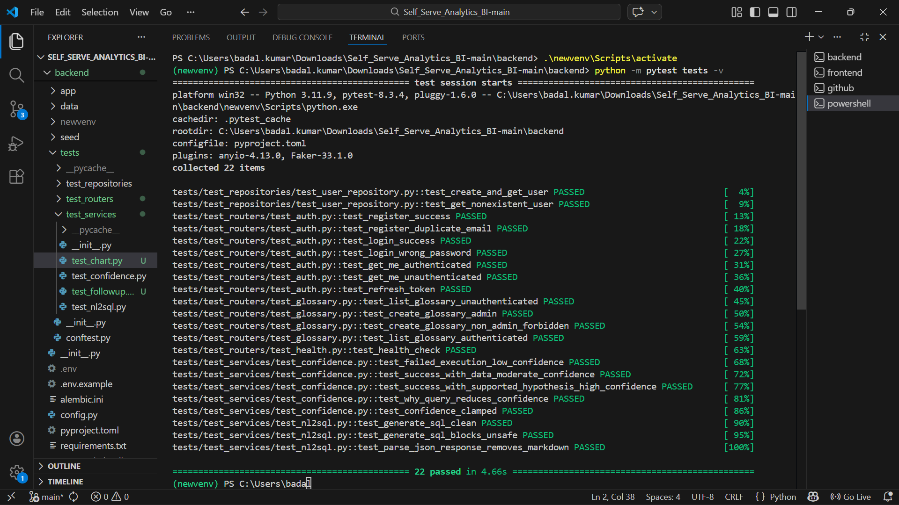

# Testing & Validation Strategy

To ensure enterprise-grade stability, this project requires a rigorous validation approach covering backend API reliability, LLM consistency, frontend UX, and data pipeline integrity.

## 1. Automated Test Coverage (pytest)

The `backend/tests/` suite is structured to cover the following layers:

### Unit Tests
- **Services (`test_services/`)**: Test business logic without database or LLM dependencies.
  - `test_sql_execution`: Mock DuckDB, assert results are formatted correctly.
  - `test_export`: Assert PDF generation correctly handles valid Vega-Lite specs.
  - `test_auth`: Verify JWT generation, expiry, and validation logic.

### Integration Tests
- **Repositories (`test_repositories/`)**: Test SQLAlchemy ORM against an in-memory SQLite database.
- **Routers (`test_routers/`)**: Use `TestClient` from FastAPI to hit endpoints.
  - Verify `/api/v1/queries` correctly routes and returns status `200` with the expected schema.
  - Verify `/api/v1/auth/login` returns valid JWTs.

### E2E / LLM Validation Tests
Testing non-deterministic LLM outputs requires strict assertion boundaries:
- Use fixed prompt injections and mock the `LLMClient` to return known SQL strings.
- Validate that `AnswerSynthesisService` correctly identifies "No data" vs. "Data exists".

## 2. Manual Validation Queries

Before any major release, run these queries in the UI to manually validate the NL2SQL engine, DuckDB pipeline, and chart renderer:

| Category | Query | Expected Result |
|---|---|---|
| **Simple Aggregation** | "What is the total revenue?" | Single KPI metric, no chart, high confidence. |
| **Group By / Chart** | "Show me total revenue by subscription tier." | Bar or Pie chart showing Free, Pro, Enterprise splits. |
| **Time Series** | "How many signups did we have per month?" | Line chart over time, sorted chronologically. |
| **Relational JOIN** | "What is the payment failure rate for Enterprise users?" | Metric or Bar chart joining `users` and `payments` tables. |
| **Empty State** | "Show me payments from the year 2050." | Graceful "No data available" message, no broken chart. |

## 3. Pre-Release Regression Checklist

- [ ] **Auth Flow:** Can a new user register, log in, and receive a JWT?
- [ ] **Schema Retrieval:** Does a query about "users" correctly load the `users` table schema into the LLM context?
- [ ] **Data Pipeline:** Does `seed_data.py` successfully regenerate the database without constraints errors?
- [ ] **Exports:** Can you download a PDF report containing a rendered chart from a successful query?
- [ ] **UI Responsiveness:** Does the chart panel resize correctly on smaller screens without overlapping the chat input?
- [ ] **Audit Logging:** Are query requests appearing in the terminal logs via `AuditMiddleware`?

#Results

