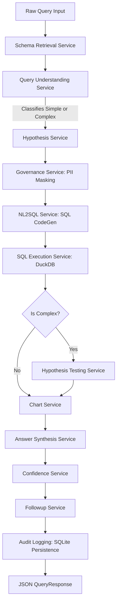

# Backend Business Logic & Service Reference

This document provides a highly detailed, service-by-service explanation of the **Backend Engine** (FastAPI + SQL + LLM RAG + DuckDB pipeline). It outlines exactly how natural language queries are processed, secured, executed, visualized, and stored, documenting the inputs, return values, schema structures, and database persistence layouts.

---

## 🏗️ Architectural Overview & Pipeline Orchestration

At the heart of the backend is the **`PipelineService`**, which acts as the main transaction coordinator. It manages the lifecycle of a query from raw string inputs to full structured insights.

### 🔄 The End-to-End Query Execution Pipeline



---

## 🛠️ Deep Dive: Service-by-Service Breakdown

### 1. Orchestration & Core Pipeline
#### 📄 [pipeline_service.py](file:///c:/Users/badal.kumar/Downloads/Self_Serve_Analytics_BI-main/backend/app/services/pipeline_service.py)
*   **Purpose**: Orchestrates all sub-services, handles timer latency logging, formats state payloads, runs exception fallbacks, and persists final logs.
*   **Method Signature**:
    ```python
    def run(self, query: str, session_id: Optional[str] = None) -> QueryResponse:
    ```
*   **Inputs**:
    *   `query`: `str` — Raw user question (e.g., *"Why did revenue drop in the last 30 days?"*).
    *   `session_id`: `Optional[str]` — UUID tracking the browser conversation session.
*   **Return Type**: `QueryResponse` (Pydantic model) containing:
    *   `id`: `int` — Database log ID of the transaction.
    *   `answer`: `str` — Synthesized response text.
    *   `sql`: `str` — Executed SQL query.
    *   `explanation`: `str` — Explanation of what the SQL query does.
    *   `data`: `List[dict]` — Raw dataset records (first 100 rows).
    *   `hypotheses`: `List[HypothesisResult]` — Hypotheses generated/tested.
    *   `best_hypothesis`: `Optional[HypothesisResult]` — The top supported explanation.
    *   `confidence`: `float` — Metric query confidence score.
    *   `confidence_reason`: `str` — Contextual breakdown of score logic.
    *   `chart`: `Optional[dict]` — Altair visual layout specs.
    *   `follow_up_suggestions`: `List[str]` — Suggested consecutive queries.
    *   `provenance`: `ProvenanceInfo` — Run metadata details.
    *   `latency_ms`: `float` — Execution latency duration.
    *   `created_at`: `datetime` — Log creation timestamp.

---

### 2. Query Understanding & Classification
#### 📄 [query_understanding_service.py](file:///c:/Users/badal.kumar/Downloads/Self_Serve_Analytics_BI-main/backend/app/services/query_understanding_service.py)
*   **Purpose**: Parses intent parameters and determines complexity classification.
*   **Method Signature**:
    ```python
    def parse(self, query: str) -> dict:
    ```
*   **Inputs**: `query`: `str`
*   **Return Value**: `dict` containing:
    ```json
    {
      "complexity": "simple" | "complex",
      "metric": "revenue" | "transactions" | "avg_value" | "failures" | "success_rate",
      "time_filter": "7d" | "30d" | "monthly" | "quarterly" | "yearly" | "none",
      "comparison": "yes" | "no",
      "entities": ["list", "of", "extracted", "entities"]
    }
    ```
*   **Technical Detail**: Automatically upgrades any query contains `"why"` or `"reason"` to `"complex"` status, triggering causal hypothesis testing.

---

### 3. Vector Index & Schema Retrieval
#### 📄 [schema_retrieval_service.py](file:///c:/Users/badal.kumar/Downloads/Self_Serve_Analytics_BI-main/backend/app/services/schema_retrieval_service.py)
*   **Purpose**: Matches natural language questions against database catalog column metadata.
*   **Method Signature**:
    ```python
    def retrieve(self, query: str, k: int = 5) -> str:
    ```
*   **Inputs**:
    *   `query`: `str` — Question text.
    *   `k`: `int` — Top-$K$ column descriptions to retrieve.
*   **Return Value**: `str` — Plain text schema block formatted for LLM context.
    *   *Example Output*:
        ```text
        Table: payments, Column: amount (FLOAT): Transaction amount in the local currency | Sample values: [10.50, 250.00]
        Table: payments, Column: status (VARCHAR): Transaction outcome status | Sample values: ['SUCCESS', 'FAILED']
        ```
*   **Internal Mechanics**: FAISS index generates semantic column matching using vector queries.

---

### 4. Semantic Glossary & Terms
#### 📄 [glossary_service.py](file:///c:/Users/badal.kumar/Downloads/Self_Serve_Analytics_BI-main/backend/app/services/glossary_service.py)
*   **Purpose**: Translates corporate vocabulary terms into operational SQL logic.
*   **Method Signature**:
    ```python
    def get_all(self) -> List[BusinessGlossary]:
    ```
*   **Return Value**: `List[BusinessGlossary]` (SQLAlchemy objects).
*   **Prompt Formatting**: Converts database items into strings formatted as:
    ```text
    - term: SQL expression (e.g. "Revenue: SUM(amount) FILTER (WHERE status='SUCCESS')")
    ```

---

### 5. Compliance & Security (Data Governance)
#### 📄 [governance_service.py](file:///c:/Users/badal.kumar/Downloads/Self_Serve_Analytics_BI-main/backend/app/services/governance_service.py)
*   **Purpose**: Enforces RBAC permissions, PII columns masking, and row filters.
*   **Methods & Returns**:
    *   `mask_pii_in_context(schema_context: str, user_role: str) -> str`: Returns sanitized schema context string. If role is not `"admin"`, removes sensitive lines.
    *   `check_table_access(table_name: str, user_role: str) -> bool`: Returns `True` if role has access to `table_name`.
    *   `get_row_filters(table_name: str, user_role: str) -> List[str]`: Returns row-level filter expressions (e.g., `["country = 'USA'"]`).
    *   `get_masked_columns(table_name: str, user_role: str) -> List[str]`: Returns names of sensitive database columns that must be masked.

---

### 6. SQL Generation & Safety Filters
#### 📄 [nl2sql_service.py](file:///c:/Users/badal.kumar/Downloads/Self_Serve_Analytics_BI-main/backend/app/services/nl2sql_service.py)
*   **Purpose**: Generates semantic DuckDB SQL statements from natural language.
*   **Method Signature**:
    ```python
    def generate(self, query: str, schema_context: str, glossary_definitions: List[str] | None = None, context_block: str = "") -> tuple[str, str]:
    ```
*   **Inputs**:
    *   `query`: `str` — NL query.
    *   `schema_context`: `str` — Target RAG schema snippet.
    *   `glossary_definitions`: `List[str]` — Business definitions.
    *   `context_block`: `str` — Conversation context (prior queries).
*   **Return Value**: `tuple[str, str]` — `(sql_query, explanation)`.
*   **Security Validation**:
    *   Blocks queries not beginning with `SELECT` or `WITH`.
    *   Throws `UnsafeSQLException` if semicolon injection `;` is detected or forbidden keywords are used.

---

### 7. SQL Execution Engine
#### 📄 [sql_execution_service.py](file:///c:/Users/badal.kumar/Downloads/Self_Serve_Analytics_BI-main/backend/app/services/sql_execution_service.py)
*   **Purpose**: Executes generated SQL queries inside an in-memory DuckDB database instance.
*   **Method Signature**:
    ```python
    def execute(self, sql: str) -> Tuple[Optional[pd.DataFrame], bool]:
    ```
*   **Inputs**: `sql`: `str` — The sanitized SQL query.
*   **Return Value**: `Tuple[Optional[pd.DataFrame], bool]` — `(dataframe, success_status)`.
*   **Internal Data Flow**:
    1.  Checks caches for memory representation of `users` and `payments` tables.
    2.  Loads from SQLite `data/payments.db` data warehouse if cache is empty.
    3.  Registers tables as Virtual Relations in a temporary DuckDB connection.
    4.  Executes the query and returns execution results as a Pandas DataFrame.

---

### 8. Hypothesis Generation & Testing
#### 📄 [hypothesis_service.py](file:///c:/Users/badal.kumar/Downloads/Self_Serve_Analytics_BI-main/backend/app/services/hypothesis_service.py)
*   **Purpose**: Generates logical explanations for complex root-cause queries.
*   **Method Signature**:
    ```python
    def generate(self, query: str, complexity: str) -> List[str]:
    ```
*   **Inputs**:
    *   `query`: `str` — Question.
    *   `complexity`: `str` — `"simple"` or `"complex"`.
*   **Return Value**: `List[str]` — A list of 3 to 5 candidate causal statements.
    *   *Example Output*:
        ```json
        [
          "Increased failures are due to wallet transaction method drops",
          "Transaction declines are driven by card payment issues"
        ]
        ```

#### 📄 [hypothesis_testing_service.py](file:///c:/Users/badal.kumar/Downloads/Self_Serve_Analytics_BI-main/backend/app/services/hypothesis_testing_service.py)
*   **Purpose**: Validates generated hypotheses against factual database metrics.
*   **Method Signature**:
    ```python
    def test_hypotheses(self, hypotheses: List[str], metric: str, time_filter: str) -> List[dict]:
    ```
*   **Inputs**:
    *   `hypotheses`: `List[str]` — Candidate causal explanations.
    *   `metric`: `str` — Current context metric (e.g. `revenue`, `failures`).
    *   `time_filter`: `str` — Active time window parameter (e.g. `30d`).
*   **Return Value**: `List[dict]` — List of evaluation records.
    *   *Example Output*:
        ```json
        [
          {
            "hypothesis": "Increased failures are due to wallet transaction method drops",
            "metric": "failures",
            "current": 432.0,
            "previous": 120.0,
            "change_pct": 260.0,
            "supported": true,
            "sql": "SELECT COUNT(*) FILTER (WHERE created_at >= CURRENT_TIMESTAMP - INTERVAL '30 days') AS current_val, ..."
          }
        ]
        ```
*   **Testing Protocol**:
    1.  **Generate Test Plan**: LLM constructs a test parameters object:
        ```json
        {
          "metric": "failures",
          "aggregation": "count",
          "condition": "payment_method='WALLET' AND status='FAILED'",
          "direction": "increase"
        }
        ```
    2.  **Generate SQL**: SQL query calculates metric values for both current and past intervals:
        ```sql
        SELECT
          COUNT(*) FILTER (WHERE created_at >= CURRENT_TIMESTAMP - INTERVAL '30 days') AS current_val,
          COUNT(*) FILTER (
            WHERE created_at < CURRENT_TIMESTAMP - INTERVAL '30 days'
            AND created_at >= CURRENT_TIMESTAMP - INTERVAL '30 days' * 2
          ) AS previous_val
        FROM df
        WHERE payment_method='WALLET' AND status='FAILED';
        ```
    3.  **Evaluate Direction**: Evaluates if the observed metric change (e.g. `current_val > previous_val`) supports the hypothesis direction (`"increase"`).
    4.  **Rank Explanations**: `select_best(hypothesis_results)` returns the single hypothesis with the largest absolute change (`change_pct`).

---

### 9. Visualization Spec Generation
#### 📄 [chart_service.py](file:///c:/Users/badal.kumar/Downloads/Self_Serve_Analytics_BI-main/backend/app/services/chart_service.py)
*   **Purpose**: Creates dashboard charts using results data.
*   **Method Signatures**:
    *   `decide_chart_type(query: str, df: Optional[pd.DataFrame]) -> str`: Returns `"line"`, `"bar"`, or `"none"`.
    *   `generate_chart(df: Optional[pd.DataFrame], chart_type: str) -> Optional[dict]`: Generates an Altair chart, returning a Vega-Lite visual specification JSON object.

---

### 10. Natural Response Synthesis
#### 📄 [answer_synthesis_service.py](file:///c:/Users/badal.kumar/Downloads/Self_Serve_Analytics_BI-main/backend/app/services/answer_synthesis_service.py)
*   **Purpose**: Translates raw database rows and hypothesis stats into plain English answers.
*   **Method Signature**:
    ```python
    def synthesize(self, query: str, result_df: Optional[pd.DataFrame], insight_data: Optional[dict] = None) -> str:
    ```
*   **Inputs**:
    *   `query`: `str` — Original question.
    *   `result_df`: `Optional[pd.DataFrame]` — DuckDB query results.
    *   `insight_data`: `Optional[dict]` — Causal hypothesis findings (`current`, `previous`, `change_pct`).
*   **Return Value**: `str` — Markdown formatted text summary.
*   **Anomalies Detection**: Scans query output for columns containing high null values ($>20\%$) or numerical outliers ($Z$-Score $> 3$) and appends warning messages to the response.

---

### 11. Confidence Scoring
#### 📄 [confidence_service.py](file:///c:/Users/badal.kumar/Downloads/Self_Serve_Analytics_BI-main/backend/app/services/confidence_service.py)
*   **Purpose**: Calculates query result confidence.
*   **Method Signature**:
    ```python
    def compute(self, success: bool, row_count: int, hypothesis_results: Optional[List[dict]], query: str) -> Tuple[float, str]:
    ```
*   **Inputs**:
    *   `success`: `bool` — SQL execution status.
    *   `row_count`: `int` — Returned data row count.
    *   `hypothesis_results`: `Optional[List[dict]]` — Hypothesis testing outputs.
    *   `query`: `str` — NL query.
*   **Return Value**: `Tuple[float, str]` — `(score, explanation_text)`.
*   **Scoring Logic Rules**:
    *   Base Score = `0.6`
    *   SQL Execution Failure $\rightarrow$ Returns `(0.3, "Low confidence due to query execution failure.")`
    *   Row Count $> 0$ $\rightarrow$ Add `+0.1` (Reason: `"sufficient data available"`)
    *   Row Count $= 0$ $\rightarrow$ Deduct `-0.2` (Reason: `"no data returned"`)
    *   At least one hypothesis is supported $\rightarrow$ Add `+0.15` (Reason: `"hypothesis supported by data"`)
    *   No hypothesis supported $\rightarrow$ Deduct `-0.1` (Reason: `"no strong hypothesis support"`)
    *   Query is reasoning-based (`"why"`, `"reason"`) $\rightarrow$ Deduct `-0.05` (Reason: `"reasoning-based query (inherently uncertain)"`)
    *   Output score is bounded between `0.1` and `0.95`.
    *   **Score Levels**: High ($\ge 0.65$), Moderate ($\ge 0.45$), Low ($< 0.45$).

---

## 💾 Storage & Data Persistence Blueprint

The application state (authentication, logs, configuration) is stored in a SQLite database (`analytics.db`), separate from the source database (`payments.db`).

```
📂 data/
 ├── analytics.db  <-- Application Metadata, Auth, Glossary, Rules, & Log Audit Store
 └── payments.db   <-- Analytical Target Data Warehouse (Source payments & user accounts)
```

### Application Database: `analytics.db` (SQLite Schema)

#### 1. `users` (Authentication & Platform Roles)
Stores system users and application access permissions.
*   `id`: `INTEGER` (Primary Key, Autoincrement)
*   `email`: `VARCHAR(255)` (Unique, Indexed, Not Null)
*   `hashed_password`: `VARCHAR(255)` (Not Null)
*   `full_name`: `VARCHAR(255)` (Not Null)
*   `role`: `VARCHAR(50)` (Not Null, default `"analyst"`)
*   `is_active`: `BOOLEAN` (Not Null, default `True`)
*   `created_at` / `updated_at`: `TIMESTAMP`

#### 2. `query_logs` (Audit History & Analytics State)
Caches generated SQL queries, LLM metrics, Vega specs, and tested hypotheses.
*   `id`: `INTEGER` (Primary Key, Autoincrement)
*   `user_id`: `INTEGER` (Foreign Key referencing `users.id`, Indexed, Not Null)
*   `session_id`: `VARCHAR(100)` (Indexed, Nullable)
*   `natural_language_query`: `TEXT` (Not Null)
*   `generated_sql`: `TEXT` (Nullable)
*   `parsed_intent`: `JSON` (Nullable) — intent parameters dict.
*   `hypotheses`: `JSON` (Nullable) — List of candidate hypothesis strings.
*   `best_hypothesis`: `JSON` (Nullable) — Causal analysis result dictionary.
*   `result_summary`: `JSON` (Nullable) — Data subset records and row counts.
*   `confidence_score`: `FLOAT` (Nullable)
*   `confidence_reason`: `TEXT` (Nullable)
*   `chart_spec`: `JSON` (Nullable) — Vega-Lite visual representation.
*   `answer_text`: `TEXT` (Nullable) — Plain english answer markdown.
*   `follow_up_suggestions`: `JSON` (Nullable) — String array.
*   `provenance`: `JSON` (Nullable) — Table lineage metadata.
*   `llm_tokens_used`: `INTEGER` (Nullable)
*   `latency_ms`: `FLOAT` (Nullable)
*   `created_at`: `TIMESTAMP` (Not Null)

#### 3. `feedback` (User Rating Logs)
Tracks user ratings for query validation.
*   `id`: `INTEGER` (Primary Key, Autoincrement)
*   `query_log_id`: `INTEGER` (Foreign Key referencing `query_logs.id`, Unique, Indexed, Not Null)
*   `user_id`: `INTEGER` (Foreign Key referencing `users.id`, Indexed, Not Null)
*   `rating`: `VARCHAR(10)` (Not Null) — `"up"` or `"down"`
*   `corrected_sql`: `TEXT` (Nullable)
*   `comment`: `TEXT` (Nullable)
*   `created_at`: `TIMESTAMP` (Not Null)

#### 4. `business_glossary` (Metrics Dictionary)
Defines semantic KPIs.
*   `id`: `INTEGER` (Primary Key, Autoincrement)
*   `term`: `VARCHAR(255)` (Unique, Indexed, Not Null)
*   `definition`: `TEXT` (Not Null)
*   `sql_expression`: `TEXT` (Not Null)
*   `category`: `VARCHAR(100)` (Nullable)
*   `created_by`: `INTEGER` (Foreign Key referencing `users.id`, Nullable)
*   `created_at` / `updated_at`: `TIMESTAMP`

#### 5. `data_catalog` (Data Catalog Definitions)
Stores catalog schema metadata.
*   `id`: `INTEGER` (Primary Key, Autoincrement)
*   `table_name`: `VARCHAR(255)` (Indexed, Not Null)
*   `column_name`: `VARCHAR(255)` (Not Null)
*   `data_type`: `VARCHAR(100)` (Not Null)
*   `description`: `TEXT` (Not Null)
*   `sample_values`: `JSON` (Nullable) — Text representation of sample records.
*   `is_pii`: `BOOLEAN` (Not Null, default `False`)
*   `is_active`: `BOOLEAN` (Not Null, default `True`)
*   `created_at` / `updated_at`: `TIMESTAMP`

#### 6. `governance_rules` (Security & Filtering Rules)
Stores table access rules and user roles.
*   `id`: `INTEGER` (Primary Key, Autoincrement)
*   `rule_type`: `VARCHAR(50)` (Not Null) — `"rbac"`, `"pii_mask"`, or `"row_filter"`
*   `role`: `VARCHAR(50)` (Nullable) — Target platform role.
*   `table_name`: `VARCHAR(255)` (Not Null)
*   `column_name`: `VARCHAR(255)` (Nullable)
*   `condition`: `TEXT` (Nullable) — Filter SQL conditions.
*   `is_active`: `BOOLEAN` (Not Null, default `True`)
*   `created_by`: `INTEGER` (Foreign Key referencing `users.id`, Nullable)
*   `created_at`: `TIMESTAMP` (Not Null)
